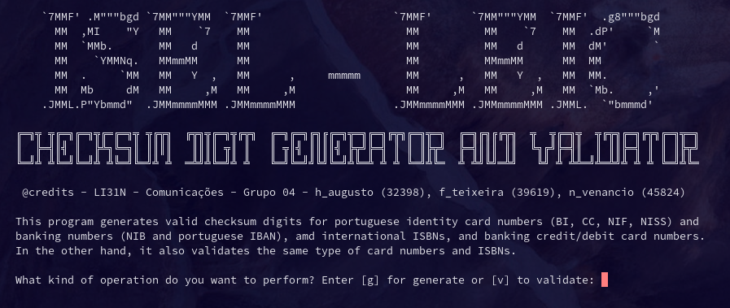

# Digit Checksum
Python terminal app that generates and validates the checksum digits for:

- portuguese
	- card numbers (BI, CC, NIF and NISS)
	- banking account numbers (NIB and IBAN)

- international
	- ISBN
	- banking credit / debit card

## Usage
To run the application, need to install [Python](https://www.python.org/downloads/) => version 3.8
Then execute in the terminal in the same directory of the app:
```terminal
$ python3 digit_checksum.py
```


## UML
The app in the [Model-View-Controller](https://en.wikipedia.org/wiki/Model%E2%80%93view%E2%80%93controller) architecture and has 3 classes ChecksumController, ChecksumView and ChecksumModel


## Goal
The primary goal for this app was a pratical assignment for the unit Digital Comunications at [LEIC - ISEL](https://www.isel.pt/curso/licenciatura/licenciatura-em-engenharia-informatica-e-de-computadores)

## License
[GNU General Public License v3.0](LICENSE.md)